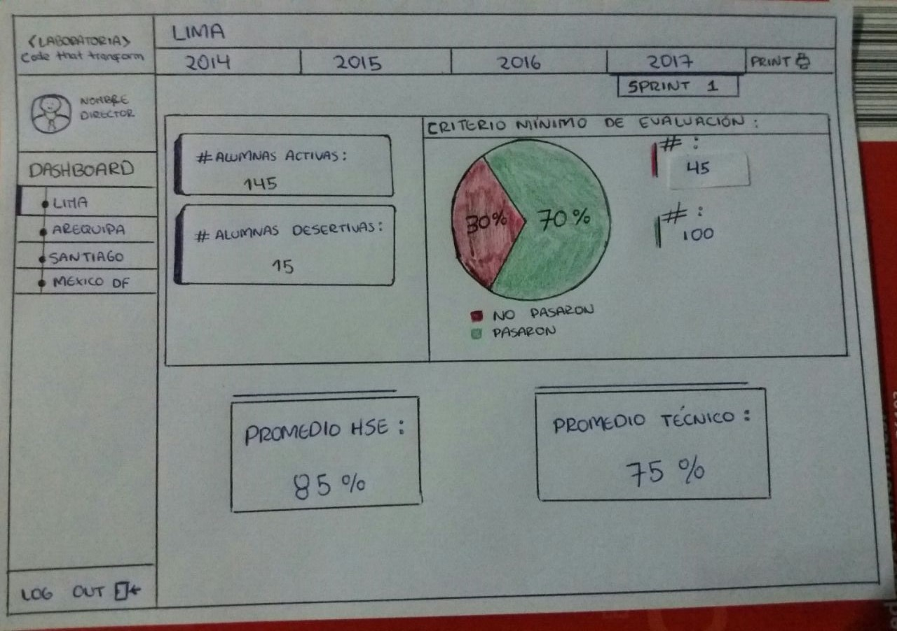

# Reto 3 - Sketch Dashboard Laboratoria

## Objetivo:
El dashboard es una herramienta utilizada por profesores, training managers, directores y gerentes de Laboratoria para ver rápidamente qué está pasando en el salón de clases de Laboratoria. En el dashboard, los usuarios mencionados pueden ver rápidamente estadísticas y datos en tiempo real como:

- Número de alumnas activas.
- Número de alumnas que desertaron.
- Número y porcentaje de alumnas que pasan el criterio mínimo de evaluación.
- Promedio de notas por sprint.
- Promedio de notas HSE.
- Promedio de notas técnicas.

Además, dado que Laboratoria tiene muchas generaciones, regularmente 2 generaciones por año (estas generaciones empezaron en el 2014), y que opera en 4 sedes (Arequipa, Ciudad de México, Lima y Santiago de Chile), es posible que los usuarios quieran ver datos de sedes / generaciones anteriores para poder hacer comparaciones.

## Resultado:

Al hacer click en dashboard saldran submenus con todas las sedes, eliges la sede y te saldra al costado todos los años, al hacer click en los años se despliega 1 generacion y 2 generacion, al elegir una te saldran todos los sprints y una opcion de __bootcamp completo__ y asi podras ver todos los datos y estadisticas en tiempo real.

## Autora: 

Laura Jimenez Hidalgo.